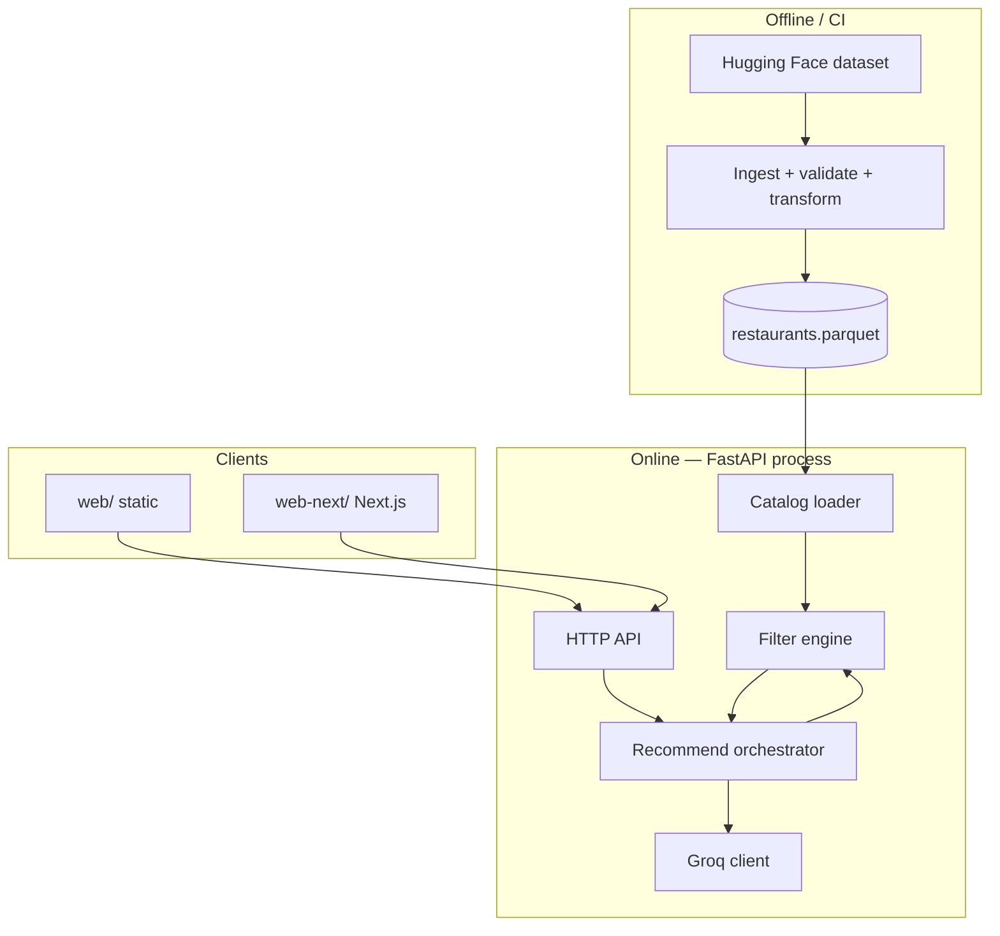
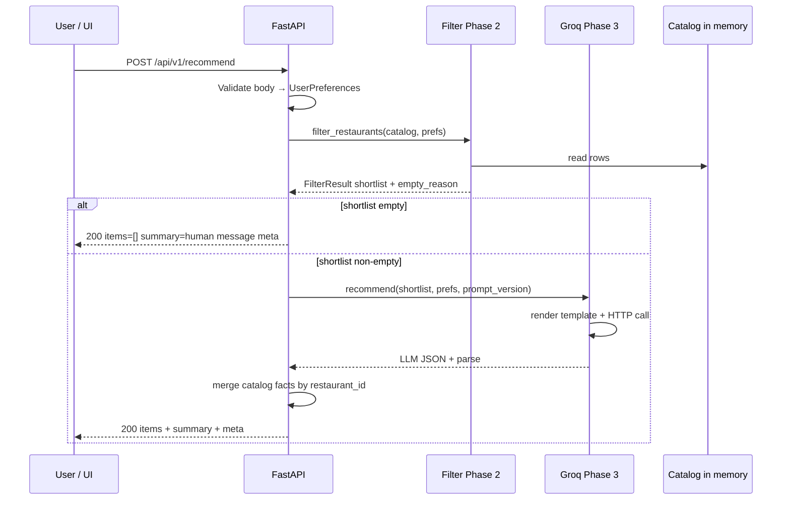
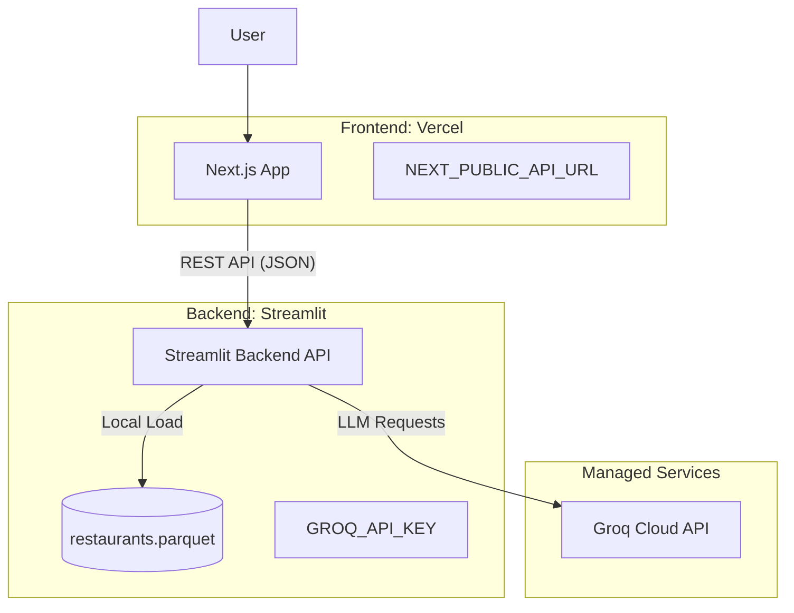

# Phase-Wise Architecture: AI-Powered Restaurant Recommendation System

**Detailed build specification** for the Zomato-style recommendation service described in `problemstatement.md`. This revision adds sequence flows, interface contracts, configuration shapes, error semantics, and operational guidance beyond the summary-level plan.

**Document version:** 2.3  
**Aligned with:** problem statement v1.8 (localities, `budget_max_inr`, dual frontend `web/` + `web-next/`). All improvements.md have been successfully verified and integrated into backend/frontend layer. **Phase 3 LLM:** **Groq** (GroqCloud); API key in **`.env`** (see §Configuration reference).

---

## Table of contents

1. [Executive summary](#executive-summary)
2. [Glossary](#glossary)
3. [System architecture (logical view)](#system-architecture-logical-view)
4. [Runtime sequence](#runtime-sequence)
5. [Configuration reference](#configuration-reference)
6. [Phase 1 — Catalog (detailed)](#phase-1--catalog-detailed)
7. [Phase 2 — Preferences and filtering (detailed)](#phase-2--preferences-and-filtering-detailed)
8. [Phase 3 — Groq integration (detailed)](#phase-3--groq-integration-detailed)
9. [Phase 4 — API and UI (detailed)](#phase-4--api-and-ui-detailed)
10. [Phase 5 — Hardening (detailed)](#phase-5--hardening-detailed)
11. [Cross-phase contracts](#cross-phase-contracts)
12. [Risks and limitations](#risks-and-limitations)
13. [Traceability](#traceability-to-problem-statement)
14. [Related documents](#related-documents)
15. [Deployment strategy](#deployment-strategy)

---

## Executive summary

The system is a **read-heavy pipeline**: a **versioned offline catalog** (Phase 1) is loaded into memory (or memory-mapped) at API startup. Each recommendation request **validates preferences** (Phase 2), **filters** to a **shortlist** bounded by configuration, **calls Groq** (GroqCloud / Groq API) with a structured prompt (Phase 3), then **merges** LLM rankings and explanations with **authoritative catalog fields** for the response (Phase 4). Phase 5 adds caching, structured logging, tests, and deployment discipline.

**Data is not loaded from Hugging Face on every request** unless you explicitly build that behavior. The intended pattern is: run **ingestion once** (or on schedule) → write `data/processed/restaurants.parquet` → the app **reads that file** at startup.

---

## Glossary

| Term | Meaning |
|------|---------|
| **Catalog** | Full set of cleaned restaurant rows in canonical schema. |
| **Shortlist** | Subset of catalog rows after deterministic filters, capped at `filter.max_shortlist_candidates`. |
| **Canonical schema** | Internal field names and types; stable across ingest, filter, prompt, and API. |
| **Merge** | Join LLM output (`restaurant_id`, `rank`, `explanation`) with catalog rows for display numerics and labels. |
| **Locality** | Fine-grained area string in the dataset; primary source for dropdown population. |

---

## System architecture (logical view)



**Boundary rule:** Phases 1–2 never call the network (except ingest script to HF). Phase 3 is the only routine production path that calls the **Groq** API.

---

## Runtime sequence



---

## Configuration reference

Use a single **`config.yaml`** (or layered env overrides) so ingest, tests, and API share tuning constants.

**Suggested shape (illustrative — names may match your repo):**

```yaml
paths:
  processed_catalog: data/processed/restaurants.parquet

dataset:
  huggingface_id: ManikaSaini/zomato-restaurant-recommendation
  split: train  # or as provided by dataset card

filter:
  max_shortlist_candidates: 40
  # Optional: relax min_rating step if shortlist < k
  # min_rating_relax_delta: 0.5
  # min_rating_relax_max_attempts: 1

llm:
  provider: groq
  model: llama-3.3-70b-versatile  # example; confirm current Groq model IDs
  temperature: 0.3
  max_tokens: 2048
  request_timeout_seconds: 60
  prompt_version: v1
  display_top_k: 5

api:
  cors_origins:
    - http://127.0.0.1:3000
    - http://localhost:3000
```

**Environment (secrets):**

| Variable | Required when | Notes |
|----------|----------------|-------|
| `GROQ_API_KEY` | Phase 3 / recommend | **Groq** API key (GroqCloud). Store in a **`.env`** file at the **project root** (or the directory your app loads env from). Load at runtime with `python-dotenv` or your framework’s equivalent so it becomes an environment variable. Add **`.env` to `.gitignore`**; commit only **`.env.example`** (placeholder values). Never commit real keys. Confirm naming in [Groq API documentation](https://console.groq.com/docs). |

**`.env` (project root, not committed):**

```env
GROQ_API_KEY=your_key_here
```

**`.env.example` (committed):**

```env
GROQ_API_KEY=
```

---

## Phase 1 — Catalog (detailed)

### 1.1 Objectives (expanded)

- **Reproducibility:** Same dataset revision + same script version → byte-identical or schema-identical output (document if non-deterministic).
- **Observability:** Log counts at each stage: raw rows → validated → transformed → written.
- **Contract stability:** Downstream phases depend only on canonical names in code, not HF column names.

### 1.2 Dataset source and load strategy

- **URI:** [ManikaSaini/zomato-restaurant-recommendation](https://huggingface.co/datasets/ManikaSaini/zomato-restaurant-recommendation)
- **Libraries:** `datasets.load_dataset(...)` or download + Parquet export if offline builds are required.
- **Splits:** Use the split documented on the dataset card; fail fast if expected split is missing.

### 1.3 Column discovery and mapping

Before coding the final mapper, run a **one-off exploration** (notebook or script) that prints:

- Column names and dtypes
- Sample rows
- Null rates per column

Then maintain an explicit **mapping table** in code or YAML:

| Raw HF column (example placeholder) | Canonical field | Transform |
|--------------------------------------|-----------------|-----------|
| *(discovered)* | `name` | strip, collapse spaces |
| *(discovered)* | `city` / `location` | `normalize_city()` |
| *(discovered)* | `locality` | same normalization rules |
| *(discovered)* | `cuisines` | `parse_cuisine_list()` |
| *(discovered)* | `rating` | float, clip or drop invalid |
| *(discovered)* | `cost` / `approx_cost` | parse INR number → `cost_for_two` |

**Rule:** If the HF schema differs from assumptions, update this table once; do not scatter string column names across Phase 2–4.

### 1.4 Stable `id` generation

If the dataset provides no stable ID:

```
id = sha256( normalized_name + "|" + normalized_locality + "|" + normalized_city )[:16]
```

Document collision handling (extremely rare): if collision, append disambiguator from row index.

### 1.5 Validation rules (suggested)

| Check | Action on failure |
|-------|-------------------|
| Missing `name` | Drop row; increment counter `drop_missing_name` |
| Missing both city and locality | Drop or quarantine; document policy |
| `rating` outside [0, 5] (or dataset scale) | Drop or nullify per policy |
| `cost_for_two` unparseable | Set null; Phase 2 excludes from strict budget filter if policy says so |

### 1.6 Normalization functions (contract)

- **`normalize_city(s)` / `normalize_locality(s)`:** Unicode normalize, trim, title case, apply alias map (e.g. `Bengaluru` → `Bangalore`).
- **`parse_cuisine_list(s)`:** Split on `|`, `,`, `/`; trim; dedupe; case-fold for matching only (preserve display case in catalog if desired).

### 1.7 Artifact and provenance

- **Output:** `data/processed/restaurants.parquet` (Snappy or ZSTD compression).
- **Optional:** Write `data/processed/ingest_manifest.json` with `{ "rows_in", "rows_out", "dataset_id", "git_sha", "timestamp", "drop_counts" }` for audit.

### 1.8 Module layout (detailed)

| Path | Contents |
|------|----------|
| `restaurant_rec/phases/phase1/schema.py` | Pydantic/dataclass `RestaurantRecord`; JSON schema export optional |
| `restaurant_rec/phases/phase1/ingest.py` | HF load, column select |
| `restaurant_rec/phases/phase1/transform.py` | Normalizers, cuisine parser, id hash |
| `restaurant_rec/phases/phase1/validate.py` | Row validators; aggregated reports |
| `scripts/ingest_zomato.py` | CLI entry: `python scripts/ingest_zomato.py [--config config.yaml]` |

### 1.9 Exit criteria (detailed)

- [ ] Example canonical row documented as JSON in README or this doc’s appendix.
- [ ] Single CLI reproduces Parquet from HF.
- [ ] Logged table of drop reasons with counts ≥ 95% of removed rows explained.

---

## Phase 2 — Preferences and filtering (detailed)

### 2.1 Objectives (expanded)

- **Determinism:** Same catalog + same preferences → same shortlist (no randomness).
- **Bounded LLM input:** Shortlist row count ≤ `filter.max_shortlist_candidates` always.
- **Explainable empties:** UI can show *why* no results (location, cuisine, rating, budget).

### 2.2 Pydantic model (detailed constraints)

Illustrative API model for **POST /api/v1/recommend** (align field names with OpenAPI):

| Field | Python type | Validation | Notes |
|-------|---------------|------------|-------|
| `location` | `str` | `min_length=1`, strip | Matches catalog locality **or** city after same normalization as Phase 1 |
| `budget_max_inr` | `float` or `int` | `gt=0`, reasonable upper cap optional (e.g. ≤ 50000) | Business rule |
| `cuisine` | `str` or `list[str]` | non-empty after normalization | Accept comma-separated in UI if you coerce server-side |
| `min_rating` | `float` | `ge=0`, `le=5` (or dataset max) | |
| `extras` | `str \| None` | max length (e.g. 500) | Prompt injection mitigation: length limit only; no execution |

### 2.3 Empty reason codes (machine-readable)

Use an enum or string constants for `FilterResult.empty_reason`:

| Code | When |
|------|------|
| `NO_LOCATION_MATCH` | No rows match normalized `location` |
| `NO_CUISINE_MATCH` | Location OK but no cuisine match |
| `NO_RATING_MATCH` | Stricter filters eliminate all |
| `NO_BUDGET_MATCH` | No row with known `cost_for_two ≤ budget_max_inr` |
| `NO_MATCHES` | Generic after all filters |
| `null` | Shortlist non-empty |

API may map these to user-facing strings in Phase 4.

### 2.4 Filter algorithm (pseudocode)

```
df = catalog
df = df[ matches_location(df, prefs.location) ]
if df.empty: return FilterResult([], NO_LOCATION_MATCH)

df = df[ matches_cuisine(df, prefs.cuisine) ]
if df.empty: return FilterResult([], NO_CUISINE_MATCH)

df = df[ df.rating >= prefs.min_rating ]
if df.empty: return FilterResult([], NO_RATING_MATCH)

df = df[ cost_known(df) & (df.cost_for_two <= prefs.budget_max_inr) ]
# If policy allows unknown cost: OR include unknown; document clearly
if df.empty: return FilterResult([], NO_BUDGET_MATCH)

df = sort(df, by=[rating desc, votes desc])
df = head(df, n=config.filter.max_shortlist_candidates)
return FilterResult(df, null)
```

**Policy decision (document in code comments):** Rows with **missing** `cost_for_two` — exclude from budget filter (strict) or include (lenient). Pick one and test both.

### 2.5 Optional relax pass

If product requires “always something”:

1. If shortlist empty and `min_rating_relax` enabled, lower `min_rating` by `delta` once and retry **only** the rating step.
2. Log `relax_applied: true` in `meta` for debugging.

### 2.6 Performance

- For catalogs &lt; ~200k rows, pandas/Polars in-memory filter is sufficient.
- For larger catalogs, consider Polars lazy scan, categorical dtypes for city/locality, or pre-index by city.

### 2.7 Exit criteria (detailed)

- [ ] Unit tests: each empty code path; full path with known fixture DataFrame.
- [ ] Benchmark log line optional: `filter_ms` for N rows in CI threshold.

---

## Phase 3 — Groq integration (detailed)

Phase 3 uses **Groq** (Groq LLM via **GroqCloud** / **Groq API**) for ranking, explanations, and optional summaries.

### 3.1 Objectives (expanded)

- **Grounding:** Model must only rank IDs present in the shortlist payload.
- **Structured output:** JSON first; degraded path documented.
- **Operational safety:** Timeouts, token limits, no key in logs.

### 3.2 Client setup and secrets

- **API key:** Keep the **Groq** API key in a **`.env`** file at the project root (or the directory the application loads environment variables from). Use `python-dotenv` (or FastAPI/pydantic-settings, etc.) so `GROQ_API_KEY` is available as `os.environ["GROQ_API_KEY"]` at runtime. **Do not commit** `.env`; commit only `.env.example` with an empty or placeholder value for `GROQ_API_KEY`.
- **SDK / HTTP:** Use the official **`groq`** Python package or an **OpenAI-compatible** client with `base_url` set to Groq’s OpenAI-compatible endpoint (see [Groq API docs](https://console.groq.com/docs)).
- **Auth:** Read the key from the environment (populated from `.env` in development): e.g. `api_key=os.environ["GROQ_API_KEY"]`.

### 3.3 Prompt structure (detailed outline)

**System message (fixed template + version id):**

- Role: expert dining recommender for Indian cities.
- Hard rules: Use **only** restaurants whose `id` appears in the provided JSON array. Do not invent venues. If the list is empty, output fixed JSON shape with empty recommendations.
- Style: concise, friendly, factual; cite rating and cost from the data when explaining.

**User message sections:**

1. **Preferences (human-readable):** locality/city, max budget for two in INR, cuisine, minimum rating, extras verbatim.
2. **Shortlist JSON:** Array of minimal objects sent to the model, e.g.  
   `{ "id", "name", "cuisines", "rating", "cost_for_two", "locality" }`  
   Omit long text fields to save tokens.

**Anti-hallucination:** Explicit line: “If you cannot justify a pick from the fields given, omit that restaurant.”

### 3.4 Example shortlist payload fragment (for prompt)

```json
{
  "restaurants": [
    {
      "id": "a1b2c3d4",
      "name": "Example Diner",
      "cuisines": ["Italian", "Continental"],
      "rating": 4.2,
      "cost_for_two": 1200,
      "locality": "Koramangala"
    }
  ],
  "task": "Return top 5 by fit. Output JSON only matching schema version v1."
}
```

### 3.5 Response parsing pipeline

1. Extract content from Groq chat completion.
2. Strip markdown fences if present (```json ... ```).
3. `json.loads` → validate with Pydantic model `LlmRecommendationResponse`.
4. On failure: **Retry once** with user message append: “Reply with valid JSON only, no markdown.”
5. On second failure: **Fallback** — sort shortlist by rating and assign generic explanation string; set `meta.degraded: true`.

### 3.6 Merge algorithm (display)

Input: validated `LlmRecommendationResponse`, catalog shortlist rows as dict keyed by `id`.

```
items = []
for rec in llm.recommendations sorted by rank:
    row = catalog_by_id.get(rec.restaurant_id)
    if row is None: log warning; skip  # model hallucinated id
    items.append({
      id, name, cuisines, rating, cost from row,
      explanation from rec,
      rank from rec
    })
```

Sort `items` by `rank`. Fill `summary` from LLM or default string if empty.

### 3.7 Error handling matrix

| Condition | Behavior |
|-----------|----------|
| Missing `GROQ_API_KEY` at runtime (not set after loading `.env`) | 503 or 500 with safe message; log error code |
| HTTP timeout | Retry 0–1 times; then fallback or 504 |
| Rate limit (429) | Backoff once; then error |
| Invalid JSON from model | Retry then fallback |

### 3.8 Exit criteria (detailed)

- [ ] ~10 manual or golden profiles documented.
- [ ] p50/p95 `duration_llm_ms` recorded for shortlist sizes 10, 40.
- [ ] Token estimate per call noted for cost planning.

---

## Phase 4 — API and UI (detailed)

### 4.1 REST contract summary

| Method | Path | Purpose |
|--------|------|---------|
| GET | `/api/v1/health` or `/health` | Liveness; optional catalog loaded flag |
| GET | `/api/v1/localities` | Distinct localities for dropdown |
| GET | `/api/v1/locations` | Distinct cities (optional) |
| POST | `/api/v1/recommend` | Main recommendation |

### 4.2 POST `/api/v1/recommend` (OpenAPI-level detail)

- **Content-Type:** `application/json`
- **Success:** `200 OK` — even when `items` is empty (filters matched nothing).
- **Validation error:** `422 Unprocessable Entity` — FastAPI default `detail` array.
- **Server / LLM failure:** `502`/`503` as appropriate; never return stack traces to client in production.

**Response headers (optional):** `X-Prompt-Version`, `X-Request-Id` (UUID) for support.

### 4.3 Discovery endpoints

- **GET `/api/v1/localities`**
  - **200:** `{ "localities": ["...", "..."] }` sorted alphabetically.
  - **Source:** distinct non-null `locality` from catalog; if locality often null, document fallback to city list only.
- **GET `/api/v1/locations`**
  - **200:** `{ "locations": ["...", "..."] }` distinct cities.

### 4.4 FastAPI application structure (suggested)

| Router / module | Responsibility |
|-----------------|----------------|
| `phases/phase4/app.py` | Create app, lifespan: load catalog, load config |
| `phases/phase4/routes/recommend.py` | POST recommend |
| `phases/phase4/routes/discovery.py` | GET localities, locations |
| `phases/phase4/deps.py` | Injected `CatalogStore`, `Settings` |

**Lifespan:** On startup, load Parquet into DataFrame or Arrow table; fail fast if file missing with clear log (points user to Phase 1 CLI).

### 4.5 Static UI (`web/`)

- **Mount:** `app.mount("/static", StaticFiles(directory="web/static"), name="static")` and serve `index.html` at `/` or use `FileResponse`.
- **Behavior:** Form fields: locality (select from GET localities), budget, cuisine, min rating, extras. `fetch(POST /api/v1/recommend)`; render cards; empty state uses `summary` or mapped `empty_reason`.

### 4.6 Next.js UI (`web-next/`)

- **Dev:** Next.js dev server on port 3000; **proxy** API calls to FastAPI (`rewrites` in `next.config.js` or explicit `NEXT_PUBLIC_API_URL`).
- **CORS:** Allow local Next origin in `config.yaml` `api.cors_origins`.
- **Parity:** Same JSON body as static UI; shared TypeScript types optional.

### 4.7 Exit criteria (detailed)

- [ ] OpenAPI `/docs` shows all endpoints.
- [ ] Two manual test cases + one empty-locality case recorded.
- [ ] Empty and error copy reviewed.

---

## Phase 5 — Hardening (detailed)

### 5.1 Caching design

- **Key:** `SHA256( canonical_json(prefs) + "|" + hash_shortlist_ids + "|" + prompt_version + "|" + model )`
- **Backend:** In-process `functools.lru_cache` for demos; Redis for multi-worker deployments.
- **TTL:** Short (e.g. 60–300s) for demos to avoid stale catalog confusion after re-ingest.

### 5.2 Structured logging schema (per request)

```json
{
  "event": "recommend_complete",
  "request_id": "uuid",
  "shortlist_size": 35,
  "duration_filter_ms": 12,
  "duration_llm_ms": 420,
  "outcome": "success",
  "degraded": false,
  "prompt_version": "v1"
}
```

Do not log full prompts or API keys. Truncate `extras` if logged at all.

### 5.3 Testing matrix (expanded)

| Layer | What to test | Tooling |
|-------|----------------|---------|
| Phase 1 | Row counts, schema, id stability | pytest + temp dir |
| Phase 2 | Filter matrix, empty codes | pytest + DataFrame fixtures |
| Phase 3 | Template render snapshot | pytest + golden file |
| Phase 4 | OpenAPI contract, status codes | httpx `TestClient` |
| Phase 3 integration | Real Groq call | pytest `-m groq` optional, skipped in CI |

### 5.4 Deployment runbook (checklist)

1. Build container image; `COPY` app code; **do not** COPY `.env`.
2. Mount volume or bake `restaurants.parquet` for demo.
3. Set `GROQ_API_KEY` in orchestrator secrets (same value as in `.env` for local dev).
4. Health check hits `/health` and verifies catalog loaded.
5. On catalog update: rolling restart after new Parquet deploy.

### 5.5 Security checklist

- [ ] `.env` in `.gitignore`; pre-commit or CI secret scan.
- [ ] Rate limit public endpoints.
- [ ] Validate and bound string lengths on `extras` and free text.
- [ ] Dependency updates for `fastapi`, `httpx`, `groq`.

### 5.6 Exit criteria (detailed)

- [ ] Runbook committed as `docs/runbook.md` or section in README.
- [ ] One load test note (e.g. 10 concurrent users, p95 latency).

---

## Cross-phase contracts

### Restaurant record (canonical JSON shape)

Illustrative single row used internally and in prompts:

```json
{
  "id": "a1b2c3d4e5f67890",
  "name": "Example Diner",
  "city": "Bangalore",
  "locality": "Koramangala",
  "cuisines": ["Italian", "Pizza"],
  "rating": 4.2,
  "cost_for_two": 1200,
  "votes": 842
}
```

### End-to-end data flow

```
HF → ingest → Parquet → [startup load] → in-memory catalog
POST prefs → filter → shortlist → prompt → Groq → parse → merge → JSON response → UI
```

---

## Risks and limitations

| Risk | Mitigation |
|------|------------|
| LLM invents `restaurant_id` | Merge step drops unknown IDs; log warnings; optional re-prompt |
| Stale or biased dataset | Version manifest; periodic re-ingest; disclaimer in UI |
| Cost / rate limits on Groq | Cache, cap shortlist size, lower `max_tokens` |
| Prompt injection via `extras` | Length limits; treat as untrusted text; no tool execution |

---

## Traceability to problem statement

| Problem statement item | Phase(s) |
|------------------------|----------|
| Load HF Zomato dataset, extract fields | 1 |
| User preferences (locality/city, budget INR, cuisine, rating, extras) | 2, 4 |
| Filter + prepare data for LLM | 2, 3 |
| Prompt for reasoning and ranking | 3 |
| LLM rank + explanations + summary | 3 |
| Display name, cuisine, rating, cost, explanation | 4 |

---

## Related documents

- `problemstatement.md` — original problem statement and prompt history.
- `improvements.md` — tracked improvements (if present in repo).

---

## Appendix: Ingest command (placeholder)

Until the implementation exists, the exact command is project-specific. Target interface:

```bash
python scripts/ingest_zomato.py --config config.yaml
```

**Prerequisite:** Python env with `datasets`, `pandas` or `polars`, `pyarrow`. **Output:** `data/processed/restaurants.parquet` as configured in `paths.processed_catalog`.

---

## 15. Deployment strategy

The system follows a split-hosting architecture to maximize the strengths of each platform, separating the compute-intensive recommendation engine from the high-performance user interface.

### 15.1 Deployment Architecture Diagram



### 15.2 Backend: Streamlit Implementation
The core recommendation engine and API logic are deployed via **Streamlit**. While primarily a UI framework, Streamlit acts as the orchestrator and compute layer for this project.

- **Hosting**: Streamlit Community Cloud (GitHub-connected).
- **Compute Strategy**: The backend utilizes a Python 3.11+ environment with `pandas` and `fastapi` (mounted within the Streamlit lifecycle).
- **Data Persistence**: 
  - The `restaurants.parquet` file is either baked into the repository or downloaded from Hugging Face during the build phase.
  - Efficient in-memory caching is used to avoid reloading the 50MB+ dataset on every user interaction.
- **Security**: 
  - `GROQ_API_KEY` is injected via Streamlit's **Secrets Management** (`.streamlit/secrets.toml` in dev, Cloud Secrets in prod).
  - CORS headers are configured to allow requests exclusively from the Vercel frontend domain.

### 15.3 Frontend: Vercel Implementation
The **Next.js** high-performance frontend is deployed on **Vercel** to provide sub-second load times and global distribution.

- **Hosting**: Vercel Edge Network.
- **CI/CD**: Automatic deployments triggered by pushes to the `main` branch.
- **Environment Management**:
  - `NEXT_PUBLIC_API_URL`: Points to the public Streamlit app URL.
- **Edge UI**: The static portions of the UI (Concierge Layout, Editorial assets) are cached at the edge, while dynamic recommendation requests are proxied to the Streamlit backend.

### 15.4 Deployment Workflow
1. **GitHub Push**: Changes merged to `main` trigger dual builds on Vercel and Streamlit.
2. **Backend Init**: Streamlit loads the restaurant catalog and validates the Groq connection.
3. **Frontend Hook**: Vercel builds the Next.js static pages and binds the API URL.
4. **Health Check**: Final validation ensures Vercel can fetch the `locality` list from the Streamlit discovery endpoint.
